# SOC Triaging Workflow: From Dashboard to True/False Positive Determination

## 🔄 Complete Workflow Structure

```mermaid
flowchart TD
    A[🛡️ SOC Dashboard Entry Point] --> B{Data Source Selection}
    
    B --> C[📊 Unified Security Alerts Dashboard<br/>soc_dashboard.py]
    B --> D[🎯 Microsoft Sentinel Dashboard<br/>main.py]
    
    %% Data Fetching Layer
    C --> E[🔄 Data Fetching Panel<br/>SelectiveWorkflowOrchestrator]
    E --> F[📡 Azure Sentinel API<br/>fetch_sentinel_data]
    F --> G[🧹 Data Cleaning<br/>clean_logs.py]
    G --> H[📊 Correlation Analysis<br/>structured_correlation_users.py]
    H --> I[📋 Alert Generation<br/>Load & Display Alerts]
    
    %% Alert Selection
    I --> J[👁️ Alert Selection<br/>User clicks View/Analyze]
    D --> J
    
    %% SOC Hub Analysis
    J --> K[🤖 SOC Hub Analysis<br/>display_ai_analysis]
    K --> L{Analysis Tabs}
    
    %% Analysis Tabs
    L --> M[🤖 AI Threat Analysis<br/>display_ai_threat_analysis_tab]
    L --> N[📊 Historical Analysis<br/>display_historical_analysis_tab]
    L --> O[📋 AI Triaging<br/>display_triaging_workflow_cached]
    L --> P[🔮 Predictions & MITRE<br/>display_predictions_tab_integrated]
    
    %% AI Threat Analysis Flow
    M --> M1[🚀 Initialize AI Engine]
    M1 --> M2[🔍 Analyze Threat Patterns]
    M2 --> M3[🌐 Research Threat Intelligence]
    M3 --> M4[📊 Generate Analysis Report]
    M4 --> M5[📥 Download Analysis Report]
    
    %% Triaging Workflow
    O --> O1[📋 Template Generation<br/>ImprovedTemplateGenerator]
    O1 --> O2[⚡ Auto-Execute Option<br/>Execute All Steps]
    O2 --> O3[📋 Interactive Steps<br/>Step-by-Step Processing]
    
    %% Step Processing Types
    O3 --> O4{Step Type Detection}
    O4 --> O5[👤 VIP User Check<br/>_is_vip_user_check_step]
    O4 --> O6[🔍 KQL Query Execution<br/>_execute_kql_query]
    O4 --> O7[🌐 IP Reputation Check<br/>_is_ip_reputation_step]
    
    %% VIP User Processing
    O5 --> O5A[📝 Parse VIP User List]
    O5A --> O5B[🔍 Check Alert Entities vs VIP]
    O5B --> O5C[🔨 Generate VIP KQL Query]
    O5C --> O5D[▶️ Execute VIP Query]
    O5D --> O5E[📊 Display VIP Results]
    
    %% KQL Processing
    O6 --> O6A[✏️ Editable Query Interface]
    O6A --> O6B[▶️ Execute KQL Query]
    O6B --> O6C[📊 Display Query Results]
    O6C --> O6D[💾 Save to State Manager]
    
    %% IP Reputation Processing
    O7 --> O7A[📝 Extract IPs from Entities]
    O7A --> O7B[🔍 VirusTotal + VPN Check]
    O7B --> O7C[📊 Risk Assessment]
    O7C --> O7D[💾 Save IP Results]
    
    %% Step Completion
    O5E --> O8[✅ Mark Step Complete]
    O6D --> O8
    O7D --> O8
    O8 --> O9{All Steps Complete?}
    O9 -->|No| O3
    O9 -->|Yes| O10[📋 Prepare Final Report]
    O10 --> O11[📥 Download Complete Template]
    O11 --> O12[🔓 Unlock Predictions Tab]
    
    %% Predictions & MITRE Analysis
    P --> P1[📤 Upload Template to API<br/>_upload_to_predictions_api]
    P1 --> P2[🔍 Entity Analysis<br/>analyze_entities_parallel]
    P2 --> P3[🧠 AI Classification<br/>complete_analysis]
    P3 --> P4{Classification Result}
    
    %% Final Classification
    P4 --> P5[🚨 TRUE POSITIVE<br/>High Risk Alert]
    P4 --> P6[✅ FALSE POSITIVE<br/>Benign Activity]
    P4 --> P7[ℹ️ REQUIRES INVESTIGATION<br/>Uncertain Classification]
    
    %% True Positive Flow
    P5 --> P5A[🎯 MITRE ATT&CK Mapping]
    P5A --> P5B[📊 Risk Assessment]
    P5B --> P5C[⚡ Immediate Actions]
    P5C --> P5D[📋 Executive Summary]
    P5D --> P5E[📥 Download Reports]
    
    %% False Positive Flow
    P6 --> P6A[✅ Mark as Resolved]
    P6A --> P6B[📝 Document Findings]
    P6B --> P6C[📊 Update Metrics]
    P6C --> P6D[📥 Download Summary]
    
    %% Investigation Required Flow
    P7 --> P7A[🔍 Additional Analysis Needed]
    P7A --> P7B[👥 Escalate to Senior Analyst]
    P7B --> P7C[📋 Investigation Plan]
    P7C --> P7D[📥 Download Investigation Guide]
    
    %% Styling
    classDef entryPoint fill:#e1f5fe,stroke:#01579b,stroke-width:3px
    classDef dashboard fill:#f3e5f5,stroke:#4a148c,stroke-width:2px
    classDef analysis fill:#e8f5e9,stroke:#1b5e20,stroke-width:2px
    classDef processing fill:#fff3e0,stroke:#e65100,stroke-width:2px
    classDef decision fill:#fce4ec,stroke:#880e4f,stroke-width:2px
    classDef result fill:#f1f8e9,stroke:#33691e,stroke-width:3px
    
    class A entryPoint
    class C,D dashboard
    class M,N,O,P analysis
    class O1,O2,O3,O4,O5,O6,O7,P1,P2,P3 processing
    class B,L,O4,O9,P4 decision
    class P5,P6,P7 result
```



## 📋 Detailed Step-by-Step Flow

### 1. **Entry Points**
- **Unified Dashboard** (`soc_dashboard.py`): Displays all alerts from multiple timelines
- **Sentinel Dashboard** (`main.py`): Microsoft Sentinel specific incidents

### 2. **Data Pipeline**
```
Azure Sentinel → Fetch Data → Clean Logs → Correlation Analysis → Alert Generation
```

### 3. **Alert Analysis Workflow**

#### **Phase 1: Initial Analysis**
1. **Alert Selection**: User clicks "View" or "Analyze" on an alert
2. **SOC Hub Launch**: Opens AI-powered analysis interface
3. **Tab Navigation**: 
   - 🤖 AI Threat Analysis
   - 📊 Historical Analysis  
   - 📋 AI Triaging
   - 🔮 Predictions & MITRE

#### **Phase 2: AI Threat Analysis**
```
Initialize AI Engine → Analyze Patterns → Research Intelligence → Generate Report
```

#### **Phase 3: Triaging Workflow**
1. **Template Generation**: AI creates investigation steps
2. **Step Processing**: Three main types:
   - **VIP User Checks**: Verify if executives are affected
   - **KQL Queries**: Execute security queries against logs
   - **IP Reputation**: Check IPs for threats/VPN/Tor

3. **Auto-Execute Option**: Runs all steps automatically
4. **Manual Processing**: Step-by-step with user input

#### **Phase 4: Predictions & Classification**
1. **Template Upload**: Completed investigation uploaded to ML API
2. **Entity Analysis**: Parallel analysis of all involved entities
3. **AI Classification**: Machine learning determines:

### 4. **Final Classification Results**

#### **🚨 TRUE POSITIVE**
- High-risk security incident
- MITRE ATT&CK technique mapping
- Immediate action recommendations
- Executive summary generation

#### **✅ FALSE POSITIVE**  
- Benign activity confirmed
- Documentation of findings
- Metrics update
- Case closure

#### **ℹ️ REQUIRES INVESTIGATION**
- Uncertain classification
- Additional analysis needed
- Escalation to senior analyst
- Investigation plan creation

## 🔧 Key Components

### **State Management**
- `TriagingStateManager`: Tracks step completion
- `TemplateCacheManager`: Caches generated templates
- Session state persistence across tabs

### **API Integrations**
- **Azure Sentinel**: Log data fetching
- **VirusTotal**: IP reputation checks
- **Predictions API**: ML classification
- **Google AI**: Analysis generation

### **Data Flow**
```
Raw Logs → Cleaned Data → Correlated Events → Security Alerts → AI Analysis → Classification
```

## 📊 Output Artifacts

1. **Analysis Reports** (Markdown/JSON)
2. **Investigation Templates** (Excel)
3. **MITRE Navigator Layers** (JSON)
4. **Executive Summaries** (Text)
5. **Classification Results** (JSON)

This workflow ensures comprehensive security incident analysis from initial alert detection through final true/false positive determination with full audit trail and documentation.